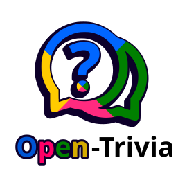

# Open-Trivia

Created by [gamedirection.net](https://gamedirection.net) © 2026  
Discord: [join.gamedirection.net](https://join.gamedirection.net)  
Credits: Alex Sierputowski @ [GameDirection.net](https://gamedirection.net)

## Overview
Open-Trivia is a multiplayer trivia platform with admin tooling, category management, adaptive difficulty, leaderboard scoring, and user analytics.

## Key Features
- Auth with password reset, Discord SSO, admin roles, and account blocking.
- Discord bot support via the `services/open-trivia-discord` submodule for slash-command, DM, and scheduled trivia.
- Question answers now collapse blank slots automatically so True/False style questions render as two full-width answers instead of four sparse buttons.
- Leaderboards with category and timeframe filters (day/month/year).
- Leaderboard privacy options: hidden emails for guests, display names, optional censoring, optional anonymous entries, Discord avatars with Gravatar fallback.
- Timer-based scoring with configurable min/max points.
- Adaptive question difficulty based on answer accuracy.
- User dashboard with stats and per-category breakdown.
- Profile & privacy: display name edits, email visibility toggle, optional avatar display, Discord avatar preference when linked.
- Question images by URL or admin uploads (png/jpg/jpeg/svg/webp).
- User suggestions can include image URLs.
- Category packs: export selected categories as zip (CSV + images), download a pack template, and import from zip, GitHub, or a GitHub release asset URL.
- Data management: backups, export/import, and per-user restore.
- CSV question import/export with template.
- Helm chart for Kubernetes deployments.

## Architecture
- Frontend: React SPA.
- Backend: Node/Express + PostgreSQL.
- Discord bot: separate Node service in `services/open-trivia-discord`.
- Images: GHCR.

## Quickstart (Docker Compose)
```bash
docker compose up -d
```

### Env (Backend)
```bash
PG_HOST=db
PG_PORT=5432
PG_USER=trivia_user
PG_PASSWORD=trivia_pass
PG_DB=trivia_db
JWT_SECRET=change-me
APP_URL=http://localhost:3000
```

### Discord SSO (optional)
```bash
DISCORD_CLIENT_ID=your-discord-app-client-id
DISCORD_CLIENT_SECRET=your-discord-app-client-secret
# Optional override. Defaults to ${APP_URL}/api/auth/discord/callback
DISCORD_REDIRECT_URI=http://localhost:3000/api/auth/discord/callback
```

Set the Discord application redirect URI to the same callback URL you configure above. You can also manage these values later from the admin panel Data section, where admins can enable/disable Discord login and view the embedded setup instructions dropdown.

### Discord Bot (optional)
```bash
DISCORD_BOT_API_TOKEN=change-me-bot-token
PUBLIC_APP_URL=http://localhost:3000
DISCORD_BOT_SERVICE_URL=http://discord-bot:3000
BOT_DISCORD_TOKEN=your-discord-bot-token
BOT_DISCORD_CLIENT_ID=your-discord-bot-client-id
BOT_SCHEDULE_POLL_MS=15000
BOT_QUESTION_TIMEOUT_SECONDS=86400
```

The bot lives in `services/open-trivia-discord` as a submodule. Configure the bot token/client ID in `.env`, start the `discord-bot` service, then use `/ot`, `/leaderboard`, and `/otschedule` in Discord.
The bot also supports `/categories` and `/help`, scheduler commands can target an optional category plus a selected Discord channel, incorrect Discord answers reveal the correct answer privately, and Discord-only players are created automatically in Open-Trivia on first answer so they can score immediately.

### Scoring Config (optional)
```bash
SCORE_MIN_POINTS=5
SCORE_MAX_EASY=10
SCORE_MAX_MED=15
SCORE_MAX_HARD=20
SCORE_FAST_MS=2000
SCORE_SLOW_MS=20000
DIFF_MIN_ATTEMPTS=25
DIFF_UP_THRESHOLD=0.4
DIFF_DOWN_THRESHOLD=0.8
```

## Admin Features
- Users: role changes, password reset, block/unblock with duration.
- Leaderboard: scheduled resets and scoring settings.
- Privacy and rate-limit settings (reports/suggestions).
- Image size limits for question images.
- Admin image uploads for questions.
- Category pack export/import (zip, GitHub, or release asset URL) + template download.
- Data section: backups/export/import plus Discord SSO and Discord bot configuration with setup guidance.

## Shared Collections
Community packs can be browsed at `questions.trivia.gamedirection.net`.  
We recommend a public GitHub repo per collection and a README that links to other collections.  
Template repo: https://github.com/Gamedirection/Open-Trivia-Questions.git  
Security note: only import zips from sources you trust.

**Category Pack Format**
- A zip per category (or a zip containing multiple category zips).
- Each category zip includes `questions.csv` and an optional `images/` folder.
- CSV `image_url` can reference `images/filename.ext` or an external URL.

## Collections Repo Template
The questions/collections repo lives as a submodule at `docs/Open-Trivia-Questions`.
The template README content used by the collections repo is `docs/Open-Trivia-Questions/README.md`.
- Data Management: backups, export/import, restore a single user.
- Questions: CSV export/import and template download.

## Contributing Question Packs
This repo includes the collections repo as a submodule at `docs/Open-Trivia-Questions`.

To contribute questions:
1. Enter the submodule: `cd docs/Open-Trivia-Questions`
2. Create/update category packs using the template zip (`template-category.zip`) and follow the README in that repo.
3. Commit and push in the submodule repo.
4. Return to this repo, commit the updated submodule pointer, and push.

If you are cloning fresh, make sure to init/update submodules:
```bash
git submodule update --init --recursive
```

## API Documentation
OpenAPI spec is served at:
```text
/openapi.json
```
Spec file:
```text
docs/openapi.json
```

## Changelog
See `docs/CHANGELOG.md`.

## Helm (K8s)
Chart location:
```text
helm/open-trivia
```
Install:
```bash
helm install open-trivia helm/open-trivia
```
Override values:
```bash
helm install open-trivia helm/open-trivia \
  --set image.frontend.tag=v0.3.3 \
  --set image.backend.tag=v0.3.3 \
  --set backend.env.JWT_SECRET=change-me
```

## Branding (Logo)
Docker Compose:
1. Place your logo at `branding/logo.png`.
2. Uncomment `REACT_APP_BRAND_LOGO_URL` and the `volumes` block under `frontend` in `docker-compose.yml`.

Helm:
1. Create a config map from your logo file: `kubectl create configmap open-trivia-logo --from-file=logo.png`.
2. Install/upgrade with `--set branding.logo.configMap=open-trivia-logo --set branding.logo.url=/brand/logo.png`.

## Docker Swarm
Create secrets (recommended):
```bash
echo "change-me" | docker secret create jwt_secret -
echo "smtp.example.com" | docker secret create smtp_host -
echo "smtp_user" | docker secret create smtp_user -
echo "smtp_pass" | docker secret create smtp_pass -
```

Deploy:
```bash
docker stack deploy -c docker-compose.yml open-trivia
```

Scale:
```bash
docker service scale open-trivia_frontend=2
docker service scale open-trivia_backend=2
```

Note: ensure the Swarm section in `docker-compose.yml` secrets is enabled.

## Deployment Notes
- Use tagged images for reproducible deployments.
- If using `latest`, always `docker compose pull` + `docker compose up -d --force-recreate`.
- For production, point `APP_URL` at the public site URL.
- PWA/service worker caching can require a hard refresh on updates.

## Production Checklist
- [ ] Confirm `JWT_SECRET` set to a strong value
- [ ] Set `APP_URL` to the public domain
- [ ] Configure SMTP (or disable)
- [ ] Enable HTTPS and HSTS on the edge proxy
- [ ] Ensure DB persistence is configured
- [ ] Set resource limits/requests (CPU/RAM) in k8s/Swarm
- [ ] Run backups and verify restore
- [ ] Confirm service worker cache invalidation on release
- [ ] Monitor logs and alerts (error rates, latency, DB size)

## License
See `LICENSE`.

## Links
- Repo: https://github.com/Gamedirection/Open-Trivia
- License: https://raw.githubusercontent.com/Gamedirection/Open-Trivia/refs/heads/main/LICENSE
- Changelog: [docs/CHANGELOG.md](docs/CHANGELOG.md)
- OpenAPI: [docs/openapi.json](docs/openapi.json)
- Helm chart: [helm/open-trivia](helm/open-trivia)
- Maintenance Checklist: [docs/Maintenance Checklist (How to)](https://github.com/Gamedirection/Open-Trivia/blob/main/docs/CHANGELOG.md#maintenance-checklist-how-to)
- Questions submodule: [docs/Open-Trivia-Questions](docs/Open-Trivia-Questions)
